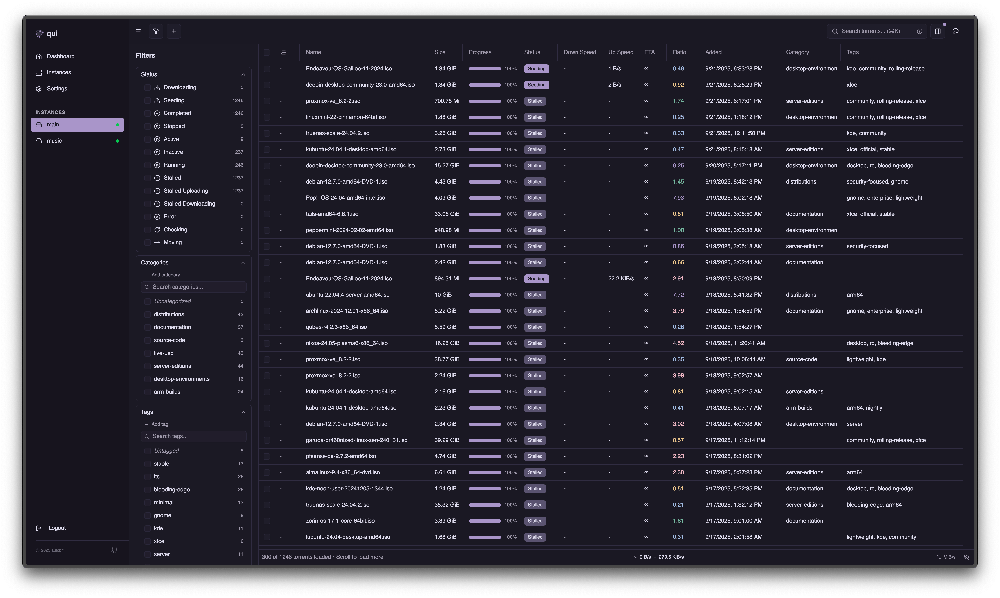

# qui

A fast, modern web interface for qBittorrent. Supports managing multiple qBittorrent instances from a single, lightweight application.

<div align="center">
  
</div>

## Features

- **Single Binary**: No dependencies, just download and run
- **Multi-Instance Support**: Manage all your qBittorrent instances from one place
- **Fast & Responsive**: Optimized for performance with large torrent collections
- **Clean Interface**: Modern UI built with React and shadcn/ui components
- **Multiple Themes**: Choose from various color themes
- **Base URL Support**: Serve from a subdirectory (e.g., `/qui/`) for reverse proxy setups
- **OIDC Single Sign-On**: Authenticate through your OpenID Connect provider


## Installation

### Quick Install (Linux x86_64)

```bash
# Download and extract the latest release
wget $(curl -s https://api.github.com/repos/autobrr/qui/releases/latest | grep browser_download_url | grep linux_x86_64 | cut -d\" -f4)
```

### Unpack

Run with root or sudo. If you do not have root, or are on a shared system, place the binaries somewhere in your home directory like ~/.bin.

```bash
tar -C /usr/local/bin -xzf qui*.tar.gz
```

This will extract both qui to /usr/local/bin. Note: If the command fails, prefix it with sudo and re-run again.

### Manual Download

Download the latest release for your platform from the [releases page](https://github.com/autobrr/qui/releases).

### Run

```bash
# Make it executable (Linux/macOS)
chmod +x qui

# Run
./qui serve
```

The web interface will be available at http://localhost:7476

### Seedbox installers

Bytesized installer (NOT TESTED)

```bash
wget -O installer.sh https://get.autobrr.com/qui/bytesized && chmod +x installer.sh && ./installer.sh
```

Feral hosting installer

```bash
wget -O installer.sh https://get.autobrr.com/qui/feral && chmod +x installer.sh && ./installer.sh
```

HostingByDesign App slots installer

```bash
wget -O installer.sh https://get.autobrr.com/qui/hostingbydesign && chmod +x installer.sh && ./installer.sh
```

Seedhost installer (NOT TESTED)

```bash
wget -O installer.sh https://get.autobrr.com/qui/seedhost && chmod +x installer.sh && ./installer.sh
```

Ultra.cc installer

```bash
wget -O installer.sh https://get.autobrr.com/qui/ultra && chmod +x installer.sh && ./installer.sh
```

Whatbox installer (NOT TESTED)

```bash
wget -O installer.sh https://get.autobrr.com/qui/whatbox && chmod +x installer.sh && ./installer.sh
```


### First Setup

1. Open your browser to http://localhost:7476
2. Create your admin account
3. Add your qBittorrent instance(s)
4. Start managing your torrents

## Updating

qui includes a built-in update command that automatically downloads and installs the latest release:

```bash
./qui update
```

**Note:** This feature is for standalone binary installations only. Docker users should pull the latest image instead:

```bash
docker compose pull && docker compose up -d
```

## Configuration

Configuration is stored in `config.toml` (created automatically on first run, or manually with `qui generate-config`). You can also use environment variables:

```bash
# Server
QUI__HOST=0.0.0.0        # Listen address
QUI__PORT=7476           # Port number
QUI__BASE_URL=/qui/      # Optional: serve from subdirectory

# Security
QUI__SESSION_SECRET=...  # Auto-generated if not set

# Logging
QUI__LOG_LEVEL=INFO      # Options: ERROR, DEBUG, INFO, WARN, TRACE
QUI__LOG_PATH=...        # Optional: log file path
QUI__LOG_MAX_SIZE=50     # Optional: rotate when log file exceeds N megabytes (default: 50)
QUI__LOG_MAX_BACKUPS=3   # Optional: retain N rotated files (default: 3, 0 keeps all)

# Storage
QUI__DATA_DIR=...        # Optional: custom data directory (default: next to config)

# Metrics
QUI__METRICS_ENABLED=true   # Optional: enable Prometheus metrics (default: false)
QUI__METRICS_HOST=127.0.0.1  # Optional: metrics server bind address (default: 127.0.0.1)
QUI__METRICS_PORT=9074       # Optional: metrics server port (default: 9074)
QUI__METRICS_BASIC_AUTH_USERS=user:hash  # Optional: basic auth for metrics (bcrypt hashed)
```

When `logPath` is set the server writes to disk using size-based rotation. Adjust `logMaxSize` and `logMaxBackups` in `config.toml` or the corresponding environment variables shown above to control the rotation thresholds and retention.

### OpenID Connect (OIDC)

Set `QUI__OIDC_ENABLED=true` to hand authentication off to an external identity provider. The built-in login screen automatically offers an "Sign in with OIDC" button when the backend detects a valid OIDC configuration.

- `QUI__OIDC_ISSUER` - Issuer URL from your IdP (e.g. `https://auth.example.com/realms/main`)
- `QUI__OIDC_CLIENT_ID` - Client ID registered for qui
- `QUI__OIDC_CLIENT_SECRET` - Client secret generated by the provider
- `QUI__OIDC_REDIRECT_URL` - Must match the redirect URI allowed by the provider. For a default install use `http://localhost:7476/api/auth/oidc/callback`. Include your base URL when reverse proxying (e.g. `https://host/qui/api/auth/oidc/callback`).
- `QUI__OIDC_DISABLE_BUILT_IN_LOGIN` - Set to `true` to hide the local username/password form when OIDC is enabled

Example configuration via environment variables:

```bash
QUI__OIDC_ENABLED=true \
QUI__OIDC_ISSUER=https://auth.example.com/realms/main \
QUI__OIDC_CLIENT_ID=qui \
QUI__OIDC_CLIENT_SECRET=super-secret-value \
QUI__OIDC_REDIRECT_URL=https://qui.example.com/api/auth/oidc/callback \
QUI__OIDC_DISABLE_BUILT_IN_LOGIN=true
```

You can set the same options in `config.toml` using the `oidc*` keys generated by `qui generate-config`.

## Backups & Restore Modes

qui can take scheduled or ad-hoc snapshots of a qBittorrent instance. Each snapshot includes the torrent archive, tags, categories (with save paths), and cached `.torrent` blobs so that you can recreate the original state later.

Once backups are enabled for an instance the backlog UI exposes a **Restore** action for each run. Restores support three distinct modes:

- Incremental – safest option. Creates any categories, tags, or torrents that are missing from the live instance but never modifies or removes existing data. Use this when you just want to seed new items into an active qBittorrent without touching what is already there.
- Overwrite – performs the incremental work **and** updates existing resources to match the snapshot (e.g. adjusts category save paths or rewrites per-torrent categories/tags). It still refuses to delete anything. This works well when your live instance has drifted but you do not want to prune it.
- Complete – full reconciliation. Runs the overwrite steps and then deletes categories, tags, and torrents that are not present in the snapshot. This is ideal when you need to roll an instance back to an earlier point in time, but it should only be used when you are certain the snapshot is authoritative.

Every restore begins with a dry-run preview so you can inspect planned changes. Unsupported differences (such as mismatched infohashes or file sizes) are surfaced as warnings; they require manual follow-up regardless of mode.


## CLI Commands

### Generate Configuration File

Create a default configuration file without starting the server:

```bash
# Generate config in OS-specific default location
./qui generate-config

# Generate config in custom directory
./qui generate-config --config-dir /path/to/config/

# Generate config with custom filename
./qui generate-config --config-dir /path/to/myconfig.toml
```

### User Management

Create and manage user accounts from the command line:

```bash
# Create initial user account
./qui create-user --username admin --password mypassword

# Create user with prompts (secure password input)
./qui create-user --username admin

# Change password for existing user (no old password required)
./qui change-password --username admin --new-password mynewpassword

# Change password with secure prompt
./qui change-password --username admin

# Pipe passwords for scripting (works with both commands)
echo "mypassword" | ./qui create-user --username admin
echo "newpassword" | ./qui change-password --username admin
printf "password" | ./qui change-password --username admin
./qui change-password --username admin < password.txt

# All commands support custom config/data directories
./qui create-user --config-dir /path/to/config/ --username admin
```

**Notes:**
- Only one user account is allowed in the system  
- Passwords must be at least 8 characters long
- Interactive prompts use secure input (passwords are masked)
- Supports piped input for automation and scripting
- Commands will create the database if it doesn't exist
- No password confirmation required - perfect for automation

**Default locations:**
- Linux/macOS: `~/.config/qui/config.toml`
- Windows: `%APPDATA%\qui\config.toml`

### Update Command

Keep your qui installation up-to-date:

```bash
# Update to the latest version
./qui update
```

### Command Line Flags

```bash
# Specify config directory (config.toml will be created inside)
./qui serve --config-dir /path/to/config/

# Specify data directory for database and other data files
./qui serve --data-dir /path/to/data/
```

## API

### Documentation

Interactive API documentation is available at `/api/docs` using Swagger UI. You can explore all endpoints, view request/response schemas, and test API calls directly from your browser.

### API Keys

API keys allow programmatic access to qui without using session cookies. Create and manage them in Settings → API Keys.

Include your API key in the `X-API-Key` header:

```bash
curl -H "X-API-Key: YOUR_API_KEY_HERE" \
  http://localhost:7476/api/instances
```

**Security Notes:**
- API keys are shown only once when created - save them securely
- Each key can be individually revoked without affecting others
- Keys have the same permissions as the main user account

## Metrics

Prometheus metrics can be enabled to monitor your qBittorrent instances. When enabled, metrics are served on a **separate port** (default: 9074) with **no authentication required** for easier monitoring setup.

### Enable Metrics

Metrics are **disabled by default**. Enable them via configuration file or environment variable:

**Config file (`config.toml`):**
```toml
metricsEnabled = true
metricsHost = "127.0.0.1"  # Bind to localhost only (recommended for security)
metricsPort = 9074         # Standard Prometheus port range
# metricsBasicAuthUsers = "user:$2y$10$bcrypt_hash_here"  # Optional: basic auth
```

**Environment variables:**
```bash
QUI__METRICS_ENABLED=true
QUI__METRICS_HOST=0.0.0.0    # Optional: bind to all interfaces if needed
QUI__METRICS_PORT=9074       # Optional: custom port
QUI__METRICS_BASIC_AUTH_USERS="user:$2y$10$hash"  # Optional: basic auth
```

### Available Metrics
- **Torrent counts** by status (downloading, seeding, paused, error)
- **Transfer speeds** (upload/download bytes per second)  
- **Instance connection status**

### Prometheus Configuration

Configure Prometheus to scrape the dedicated metrics port (no authentication required):

```yaml
scrape_configs:
  - job_name: 'qui'
    static_configs:
      - targets: ['localhost:9074']
    metrics_path: /metrics
    scrape_interval: 30s
    #basic_auth:
      #username: prometheus
      #password: yourpassword
```

All metrics are labeled with `instance_id` and `instance_name` for multi-instance monitoring.

## Tracker Icons

Cached icons live in your data directory under `tracker-icons/` (next to `qui.db`). Icons are stored as normalised 16×16 PNGs; anything larger than 1 024×1 024 is rejected, so resize first if you are supplying files manually. qui automatically attempts to download a favicon the first time it encounters a tracker host, caching the result for future sessions. After a failed download it waits 30 minutes before retrying the same host, and the next retry is triggered automatically the next time that host appears in your tracker list.

### Add icons manually

- Copy PNGs named after each tracker host (e.g. `tracker.example.com.png`) into the `tracker-icons/` directory. Files are served as-is, so trimming or resizing is up to you, but matching the built-in size (16×16) keeps them crisp and avoids extra scaling.

### Preload a bundle of icons

If you already have a library of icons (for example, exported from another installation) you can preload them via a mapping file placed alongside the directory: `tracker-icons/preload.json`, `tracker-icons/preload.js`, `tracker-icons/tracker-icons.json`, `tracker-icons/tracker-icons.js`, or `tracker-icons/tracker-icons.txt`.

- The file can be either a plain JSON object or a snippet exported as `const trackerIcons = { ... };`.
- Keys must be the real tracker hostnames (e.g. `tracker.example.org`). If you include a `www.*` host, qui automatically mirrors the icon to the bare hostname when missing.
- On startup qui decodes each data URL, normalises the image to 16×16, and writes the PNG to `<host>.png`.

  ```json
  {
    "tracker.example.org": "data:image/png;base64,AAA...",
    "www.tracker.org": "data:image/png;base64,BBB..."
  }
  ```

  ```js
  const trackerIcons = {
    "tracker.example.org": "data:image/png;base64,CCC...",
    "www.tracker.org": "data:image/png;base64,DDD..."
  };
  ```

- Example: [Audionut/add-trackers](https://github.com/Audionut/add-trackers/blob/8db05c0e822f9b3afa46ca784644c4e7e400c92b/ptp-add-filter-all-releases-anut.js#L768)

## Reverse Proxy for External Applications

qui includes a built-in reverse proxy that allows external applications like autobrr, Sonarr, Radarr, and other tools to connect to your qBittorrent instances **without needing qBittorrent credentials**. qui handles authentication transparently, making integration seamless.

### How It Works

The reverse proxy feature:
- **Handles authentication automatically** - qui manages the qBittorrent login using your configured credentials
- **Isolates clients** - Each client gets its own API key
- **Provides transparent access** - Clients see qui as if it were qBittorrent directly
- **Reduces login thrash** - qui maintains a shared cookie jar and session, so your automation tools stop racing to re-authenticate against qBittorrent. That means fewer failed logins, less load on qBittorrent, and faster announce races because downstream apps reuse the live session instead of waiting for new tokens.
- **Future-aware sync** - A planned improvement will reuse the proxied responses from other tools to keep qui's own torrent data fresh without waiting for the next poll cycle.

### Setup Instructions

#### 1. Create a Client Proxy API Key

1. Open qui in your browser
2. Go to **Settings → Client Proxy Keys**
3. Click **"Create Client API Key"** 
4. Enter a name for the client (e.g., "Sonarr")
5. Choose the qBittorrent instance you want to proxy
6. Click **"Create Client API Key"**
7. **Copy the generated proxy url immediately** - it's only shown once

#### 2. Configure Your External Application

Use qui as the qBittorrent host with the special proxy URL format:

**Complete URL example:**
```
http://localhost:7476/proxy/abc123def456ghi789jkl012mno345pqr678stu901vwx234yz
```

#### Application-Specifics

**Sonarr / Radarr**
- Go to `Settings → Download Clients`
- Select `Show Advanced`
- Add a new **qBittorrent** client
- Set the host and port of qui
- Add URL Base (`/proxy/...`) - remember to include /qui/ if you use custom baseurl
- Click **Test** and then **Save** once the test succeeds

**autobrr**
- Open `Settings → Download Clients`
- Add **qBittorrent** (or edit an existing one)
- Enter the full url like: `http://localhost:7476/proxy/abc123def456ghi789jkl012mno345pqr678stu901vwx234yz`
- Leave username/password blank and press **Test**
- Leave basic auth blank since qui handles that

**cross-seed**
- Open cross-seed config file
- Add or edit the `torrentClients` section.
- Append the full url following the documentation
- `torrentClients: ["qbittorrent:http://localhost:7476/proxy/abc123def456ghi789jkl012mno345pqr678stu901vwx234yz"],`
- Save the config file and restart cross-seed

**Upload Assistant**
- Open the Upload Assistant config file
- Add or edit `qui_proxy_url` under the qBitTorrent client settings.
- Append the full url like `"qui_proxy_url": "http://localhost:7476/proxy/abc123def456ghi789jkl012mno345pqr678stu901vwx234yz",`
- All other auth type can remain unchanged
- Save the config file

### Supported Applications

This reverse proxy will work with any application that supports qBittorrent's Web API.

### Security Features

- **API Key Authentication** - Each client requires a unique key
- **Instance Isolation** - Keys are tied to specific qBittorrent instances
- **Usage Tracking** - Monitor which clients are accessing your instances
- **Revocation** - Disable access instantly by deleting the API key
- **No Credential Exposure** - qBittorrent passwords never leave qui

### Troubleshooting

**Connection Refused Error:**
- Ensure qui is listening on all interfaces: `QUI__HOST=0.0.0.0 ./qui serve`
- Check that the port is accessible from your external application

**Authentication Errors:**  
- Verify the Client API Key is correct and hasn't been deleted
- Ensure the key is mapped to the correct qBittorrent instance

**Version String Errors:**
- This was a common issue that's now resolved with the new proxy implementation
- Try regenerating the Client API Key if you still see version parsing errors

## Docker

```bash
# Using Docker Compose
docker compose up -d

# Or standalone
docker run -d \
  -p 7476:7476 \
  -v $(pwd)/config:/config \
  ghcr.io/autobrr/qui:latest
```

### Unraid

Our release workflow builds multi-architecture images (`linux/amd64`, `linux/arm64`, and friends) and publishes them to `ghcr.io/autobrr/qui`, so the container should work on Unraid out of the box.

**Deploy from the Docker tab**
- Open **Docker → Add Container**
- Set **Name** to `qui`
- Set **Repository** to `ghcr.io/autobrr/qui:latest`
- Keep the default **Network Type** (`bridge` works for most setups)
- Add a port mapping: **Host port** `7476` → **Container port** `7476`
- Add a path mapping: **Container Path** `/config` → **Host Path** `/mnt/user/appdata/qui`
- (Optional) add environment variables for advanced settings (e.g., `QUI__BASE_URL`, `QUI__LOG_LEVEL`, `TZ`)
- Click **Apply** to pull the image and start the container

The `/config` mount stores `config.toml`, the SQLite database, and logs. Point it at your preferred appdata share so settings persist across upgrades.

If the app logs to stdout, check logs via Docker → qui → Logs; if it writes to files, they’ll be under /config.

**Updating**
- Use Unraid's **Check for Updates** action to pull a newer `latest` image
- If you pinned a specific version tag, edit the repository field to the new tag when you're ready to upgrade
- Restart the container if needed after the image update so the new binary is loaded

## Base URL Configuration

If you need to serve qui from a subdirectory (e.g., `https://example.com/qui/`), you can configure the base URL:

### Using Environment Variable
```bash
QUI__BASE_URL=/qui/ ./qui
```

### Using Configuration File
Edit your `config.toml`:
```toml
baseUrl = "/qui/"
```

### With Nginx Reverse Proxy
```nginx
# Redirect /qui to /qui/ for proper SPA routing
location = /qui {
    return 301 /qui/;
}

location /qui/ {
    proxy_pass http://localhost:7476/qui/;
    proxy_set_header Host $host;
    proxy_set_header X-Real-IP $remote_addr;
    proxy_set_header X-Forwarded-For $proxy_add_x_forwarded_for;
    proxy_set_header X-Forwarded-Proto $scheme;
}
```

## qBittorrent Version Compatibility

> [!NOTE]
> qui officially supports qBittorrent 4.3.9 and newer as the baseline. The features below may require newer builds as noted, and anything older than 4.3.9 might still connect, but functionality is not guaranteed.

qui automatically detects the features available on each qBittorrent instance and adjusts the interface accordingly. Certain features require newer qBittorrent versions and will be disabled when connecting to older instances:

| Feature | Minimum Version | Notes |
| --- | --- | --- |
| **Torrent Creation** | 5.0.0+ (Web API 2.11.2+) | |
| **Torrent Export (.torrent download)** | 4.5.0+ (Web API 2.8.11+) | Added via `/api/v2/torrents/export`; first appeared in 4.5.0beta1 |
| **Backups (.torrent archive export)** | 4.5.0+ (Web API 2.8.11+) | qui backups rely on `/torrents/export`; the backup UI is hidden when the endpoint is unavailable |
| **Tracker Health Status** | 5.1.0+ (Web API 2.11.4+) | Automatically marks torrents that are either unregistered or has a tracker issue |
| **External IP Reporting (IPv4/IPv6)** | 5.1.0+ (Web API 2.11.3+) | Adds `last_external_address_v4` / `_v6`; earlier WebAPI builds expose no external IP data |

## Community

Join our friendly and welcoming community on [Discord](https://discord.autobrr.com/qui)! Connect with fellow autobrr users, get advice, and share your experiences. 
Whether you're seeking help, wanting to contribute, or just looking to discuss your ideas, our community is a hub of discussion and support. 
We're all here to help each other out, so don't hesitate to jump in!

## Contributing

Contributions are welcome! Please feel free to submit a Pull Request.

## License

GPL-2.0-or-later
