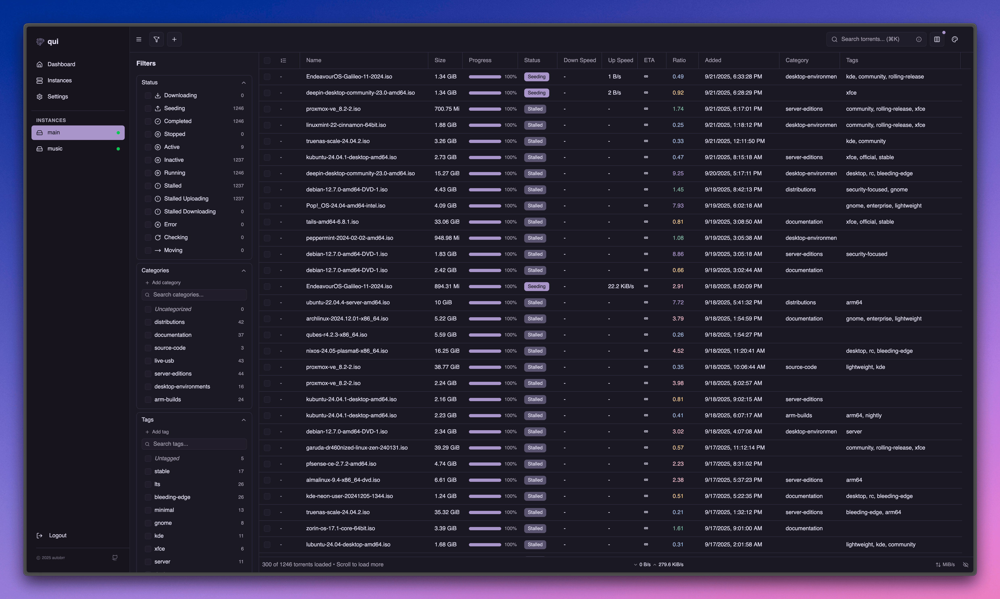

# qui

A fast, modern web interface for qBittorrent. Manage multiple qBittorrent instances from a single, lightweight application.

<div align="center">
  
</div>

## Features

- **Single Binary**: No dependencies, just download and run
- **Multi-Instance Support**: Manage all your qBittorrent instances from one place
- **Fast & Responsive**: Optimized for performance with large torrent collections
- **Real-time Updates**: Live torrent progress and status updates
- **Clean Interface**: Modern UI built with React and shadcn/ui components
- **Multiple Themes**: Choose from various color themes
- **OpenID Connect (OIDC)**: Single sign-on with external identity providers
- **Base URL Support**: Serve from a subdirectory (e.g., `/qui/`) for reverse proxy setups

## Installation

### Quick Install (Linux x86_64)

```bash
# Download and extract the latest release
wget $(curl -s https://api.github.com/repos/autobrr/qui/releases/latest | grep browser_download_url | grep linux_x86_64 | cut -d\" -f4)
```

### Unpack

Run with root or sudo. If you do not have root, or are on a shared system, place the binaries somewhere in your home directory like ~/.bin.

```bash
tar -C /usr/local/bin -xzf qui*.tar.gz
```

This will extract both qui to /usr/local/bin. Note: If the command fails, prefix it with sudo and re-run again.

### Manual Download

Download the latest release for your platform from the [releases page](https://github.com/autobrr/qui/releases).

### Run

```bash
# Make it executable (Linux/macOS)
chmod +x qui

# Run
./qui serve
```

The web interface will be available at http://localhost:7476

### First Setup

1. Open your browser to http://localhost:7476
2. Create your admin account
3. Add your qBittorrent instance(s)
4. Start managing your torrents

## Updating

qui includes a built-in update command that automatically downloads and installs the latest release:

```bash
./qui update
```

**Note:** This feature is for standalone binary installations only. Docker users should pull the latest image instead:

```bash
docker compose pull && docker compose up -d
```

## Configuration

Configuration is stored in `config.toml` (created automatically on first run, or manually with `qui generate-config`). You can also use environment variables:

```bash
# Server
QUI__HOST=0.0.0.0        # Listen address
QUI__PORT=7476           # Port number
QUI__BASE_URL=/qui/      # Optional: serve from subdirectory

# Security
QUI__SESSION_SECRET=...  # Auto-generated if not set

# OIDC Authentication (Optional)
QUI__OIDC_ENABLED=true                            # Enable OpenID Connect
QUI__OIDC_ISSUER=https://auth.example.com         # OIDC provider URL
QUI__OIDC_CLIENT_ID=your-client-id                # OAuth2 client ID
QUI__OIDC_CLIENT_SECRET=your-client-secret        # OAuth2 client secret
QUI__OIDC_REDIRECT_URL=http://localhost:7476/api/auth/oidc/callback  # Callback URL
QUI__OIDC_DISABLE_BUILT_IN_LOGIN=false           # Optional: disable password login

# Logging
QUI__LOG_LEVEL=INFO      # Options: ERROR, DEBUG, INFO, WARN, TRACE
QUI__LOG_PATH=...        # Optional: log file path

# Storage
QUI__DATA_DIR=...        # Optional: custom data directory (default: next to config)

# Metrics
QUI__METRICS_ENABLED=true   # Optional: enable Prometheus metrics (default: false)
QUI__METRICS_HOST=127.0.0.1  # Optional: metrics server bind address (default: 127.0.0.1)
QUI__METRICS_PORT=9074       # Optional: metrics server port (default: 9074)
QUI__METRICS_BASIC_AUTH_USERS=user:hash  # Optional: basic auth for metrics (bcrypt hashed)
```

## CLI Commands

### Generate Configuration File

Create a default configuration file without starting the server:

```bash
# Generate config in OS-specific default location
./qui generate-config

# Generate config in custom directory
./qui generate-config --config-dir /path/to/config/

# Generate config with custom filename
./qui generate-config --config-dir /path/to/myconfig.toml
```

### User Management

Create and manage user accounts from the command line:

```bash
# Create initial user account
./qui create-user --username admin --password mypassword

# Create user with prompts (secure password input)
./qui create-user --username admin

# Change password for existing user (no old password required)
./qui change-password --username admin --new-password mynewpassword

# Change password with secure prompt
./qui change-password --username admin

# Pipe passwords for scripting (works with both commands)
echo "mypassword" | ./qui create-user --username admin
echo "newpassword" | ./qui change-password --username admin
printf "password" | ./qui change-password --username admin
./qui change-password --username admin < password.txt

# All commands support custom config/data directories
./qui create-user --config-dir /path/to/config/ --username admin
```

**Notes:**
- Only one user account is allowed in the system  
- Passwords must be at least 8 characters long
- Interactive prompts use secure input (passwords are masked)
- Supports piped input for automation and scripting
- Commands will create the database if it doesn't exist
- No password confirmation required - perfect for automation

**Default locations:**
- Linux/macOS: `~/.config/qui/config.toml`
- Windows: `%APPDATA%\qui\config.toml`

### Update Command

Keep your qui installation up-to-date:

```bash
# Update to the latest version
./qui update
```

### Command Line Flags

```bash
# Specify config directory (config.toml will be created inside)
./qui serve --config-dir /path/to/config/

# Specify data directory for database and other data files
./qui serve --data-dir /path/to/data/
```

## API

### Documentation

Interactive API documentation is available at `/api/docs` using Swagger UI. You can explore all endpoints, view request/response schemas, and test API calls directly from your browser.

### API Keys

API keys allow programmatic access to qui without using session cookies. Create and manage them in Settings → API Keys.

Include your API key in the `X-API-Key` header:

```bash
curl -H "X-API-Key: YOUR_API_KEY_HERE" \
  http://localhost:7476/api/instances
```

**Security Notes:**
- API keys are shown only once when created - save them securely
- Each key can be individually revoked without affecting others
- Keys have the same permissions as the main user account

## Metrics

Prometheus metrics can be enabled to monitor your qBittorrent instances. When enabled, metrics are served on a **separate port** (default: 9074) with **no authentication required** for easier monitoring setup.

### Enable Metrics

Metrics are **disabled by default**. Enable them via configuration file or environment variable:

**Config file (`config.toml`):**
```toml
metricsEnabled = true
metricsHost = "127.0.0.1"  # Bind to localhost only (recommended for security)
metricsPort = 9074         # Standard Prometheus port range
# metricsBasicAuthUsers = "user:$2y$10$bcrypt_hash_here"  # Optional: basic auth
```

**Environment variables:**
```bash
QUI__METRICS_ENABLED=true
QUI__METRICS_HOST=0.0.0.0    # Optional: bind to all interfaces if needed
QUI__METRICS_PORT=9074       # Optional: custom port
QUI__METRICS_BASIC_AUTH_USERS="user:$2y$10$hash"  # Optional: basic auth
```

### Available Metrics
- **Torrent counts** by status (downloading, seeding, paused, error)
- **Transfer speeds** (upload/download bytes per second)  
- **Instance connection status**

### Prometheus Configuration

Configure Prometheus to scrape the dedicated metrics port (no authentication required):

```yaml
scrape_configs:
  - job_name: 'qui'
    static_configs:
      - targets: ['localhost:9074']
    metrics_path: /metrics
    scrape_interval: 30s
    #basic_auth:
      #username: prometheus
      #password: yourpassword
```

All metrics are labeled with `instance_id` and `instance_name` for multi-instance monitoring.

## Reverse Proxy for External Applications

qui includes a built-in reverse proxy that allows external applications like autobrr, Sonarr, Radarr, and other tools to connect to your qBittorrent instances **without needing qBittorrent credentials**. qui handles authentication transparently, making integration seamless.

### How It Works

The reverse proxy feature:
- **Handles authentication automatically** - qui manages the qBittorrent login using your configured credentials
- **Isolates clients** - Each client gets its own API key for security and monitoring  
- **Works with any qBittorrent security setting** - Even with "bypass authentication for clients on localhost" disabled
- **Provides transparent access** - Clients see qui as if it were qBittorrent directly

### Setup Instructions

#### 1. Create a Client API Key

1. Open qui in your browser
2. Go to **Settings → Client API Keys**
3. Click **"Generate New Key"** 
4. Choose the qBittorrent instance you want to proxy
5. Enter a name (e.g., "Sonarr")
6. **Copy the generated key immediately** - it's only shown once

#### 2. Configure Your External Application

Use qui as the qBittorrent host with the special proxy URL format:

**Example for Sonarr or autobrr:**
- **Host**: `your-qui-server` (e.g., `localhost` or `192.168.1.100`)
- **Port**: `7476` (or your qui port)
- **Username**: *Leave empty*
- **Password**: *Leave empty*  
- **URL Base**: `/proxy/YOUR_CLIENT_API_KEY_HERE`

**Complete URL example:**
```
http://localhost:7476/proxy/abc123def456ghi789jkl012mno345pqr678stu901vwx234yz
```

#### 3. Test the Connection

Your external application should now be able to:
- Connect successfully to qBittorrent through qui
- Add torrents, check status, and manage downloads
- Work without any qBittorrent credentials

### Supported Applications

This reverse proxy works with any application that supports qBittorrent's Web API:
- **autobrr** - Automatic torrent downloading
- **Sonarr** - Automatic TV show downloads
- **Radarr** - Automatic movie downloads  
- **Lidarr** - Automatic music downloads
- **Prowlarr** - Indexer management
- **Custom scripts** - Any application using qBittorrent's API

### Security Features

- **API Key Authentication** - Each client requires a unique key
- **Instance Isolation** - Keys are tied to specific qBittorrent instances
- **Usage Tracking** - Monitor which clients are accessing your instances
- **Revocation** - Disable access instantly by deleting the API key
- **No Credential Exposure** - qBittorrent passwords never leave qui

### Troubleshooting

**Connection Refused Error:**
- Ensure qui is listening on all interfaces: `QUI__HOST=0.0.0.0 ./qui serve`
- Check that the port is accessible from your external application

**Authentication Errors:**  
- Verify the Client API Key is correct and hasn't been deleted
- Ensure the key is mapped to the correct qBittorrent instance

**Version String Errors:**
- This was a common issue that's now resolved with the new proxy implementation
- Try regenerating the Client API Key if you still see version parsing errors

## Docker

```bash
# Using Docker Compose
docker compose up -d

# Or standalone
docker run -d \
  -p 7476:7476 \
  -v $(pwd)/config:/config \
  ghcr.io/autobrr/qui:latest
```

## OpenID Connect (OIDC) Authentication

qui supports OpenID Connect (OIDC) for single sign-on (SSO) authentication. This allows you to use external identity providers like Authentik, Keycloak, Auth0, Okta, Google, or any OIDC-compliant provider.

### Configuration

Add these settings to your `config.toml`:

```toml
# Enable OIDC authentication
oidcEnabled = true

# Your OIDC provider's issuer URL
oidcIssuer = "https://auth.example.com"

# OAuth2 client credentials from your provider
oidcClientId = "qui-client"
oidcClientSecret = "your-client-secret"

# Callback URL - must match the redirect URI configured in your provider
oidcRedirectUrl = "http://localhost:7476/api/auth/oidc/callback"

# Optional: Disable built-in password login when using OIDC
oidcDisableBuiltInLogin = false
```

Or use environment variables:

```bash
QUI__OIDC_ENABLED=true
QUI__OIDC_ISSUER=https://auth.example.com
QUI__OIDC_CLIENT_ID=qui-client
QUI__OIDC_CLIENT_SECRET=your-client-secret
QUI__OIDC_REDIRECT_URL=http://localhost:7476/api/auth/oidc/callback
QUI__OIDC_DISABLE_BUILT_IN_LOGIN=false
```

### Provider Setup

Configure your OIDC provider with these settings:

- **Redirect URI**: `http://your-qui-url/api/auth/oidc/callback`
- **Scopes**: `openid profile email`
- **Grant Type**: Authorization Code
- **Response Type**: Code

### Supported Providers

qui works with any OIDC-compliant provider, including:

- **Authentik** - Self-hosted identity provider
- **Keycloak** - Enterprise identity management
- **Auth0** - Cloud identity platform
- **Okta** - Enterprise SSO solution
- **Google** - Google Workspace SSO
- **Microsoft Azure AD** - Azure Active Directory
- **GitLab** - GitLab as identity provider
- **GitHub** (via OAuth2 adapter)

### How It Works

1. When OIDC is enabled, a "Sign in with OpenID Connect" button appears on the login page
2. Clicking the button redirects to your identity provider
3. After authentication, the provider redirects back to qui
4. qui creates a session using the OIDC claims (username, email, etc.)
5. No qui password is required - authentication is handled entirely by your OIDC provider

### Security Notes

- OIDC sessions are separate from password-based sessions
- The `oidcDisableBuiltInLogin` option can enforce OIDC-only authentication
- Username is derived from OIDC claims in this order: preferred_username, nickname, name, email, sub
- State parameter is used for CSRF protection during the OAuth flow

### Reverse Proxy Configuration

When using qui behind a reverse proxy with OIDC:

```nginx
location /qui/ {
    proxy_pass http://localhost:7476/qui/;
    proxy_set_header Host $host;
    proxy_set_header X-Real-IP $remote_addr;
    proxy_set_header X-Forwarded-For $proxy_add_x_forwarded_for;
    proxy_set_header X-Forwarded-Proto $scheme;  # Important for OIDC redirects
}
```

The `X-Forwarded-Proto` header is especially important for OIDC to generate correct redirect URLs.

## Base URL Configuration

If you need to serve qui from a subdirectory (e.g., `https://example.com/qui/`), you can configure the base URL:

### Using Environment Variable
```bash
QUI__BASE_URL=/qui/ ./qui
```

### Using Configuration File
Edit your `config.toml`:
```toml
baseUrl = "/qui/"
```

### With Nginx Reverse Proxy
```nginx
# Redirect /qui to /qui/ for proper SPA routing
location = /qui {
    return 301 /qui/;
}

location /qui/ {
    proxy_pass http://localhost:7476/qui/;
    proxy_set_header Host $host;
    proxy_set_header X-Real-IP $remote_addr;
    proxy_set_header X-Forwarded-For $proxy_add_x_forwarded_for;
    proxy_set_header X-Forwarded-Proto $scheme;
}
```

## Development

### Quick Start for Developers

```bash
# Requirements: Go 1.24+ and Node.js 22+

# Run both frontend and backend in dev mode
make dev

# Run backend only (with hot reload)
make dev-backend

# Run frontend only  
make dev-frontend
```

## Features in Detail

### Instance Management
- Add unlimited qBittorrent instances
- Health monitoring and auto-reconnection
- Secure credential storage

### Torrent Management
- Bulk operations (pause, resume, delete)
- Advanced filtering and search
- Category and tag management
- Real-time progress tracking

### Performance
- Efficient data sync for large collections
- Minimal memory footprint
- Fast search and filtering
- Responsive UI with virtual scrolling

## Contributing

Contributions are welcome! Please feel free to submit a Pull Request.

## License

GPL-2.0-or-later